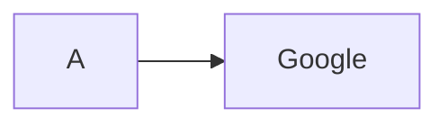
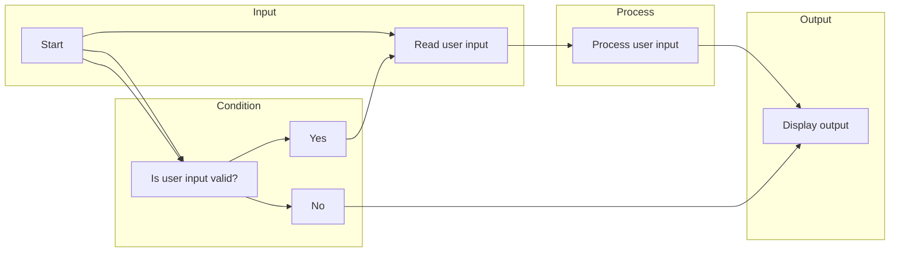
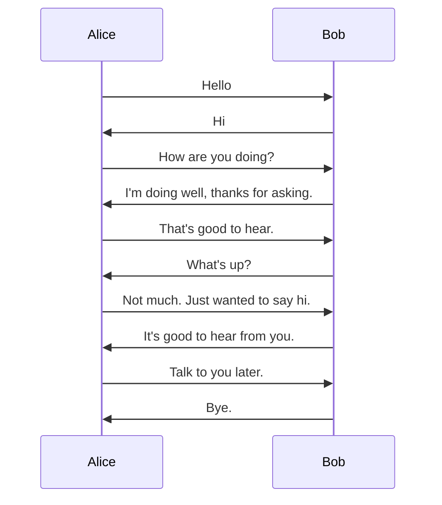
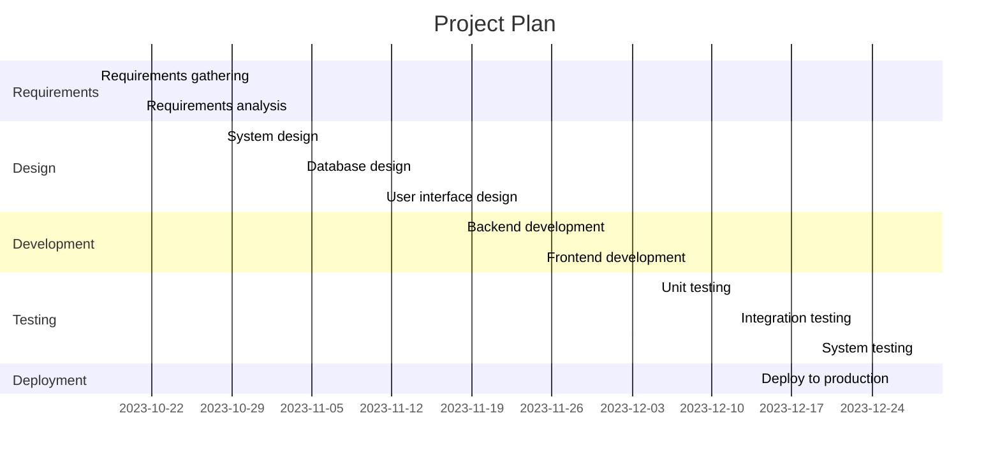
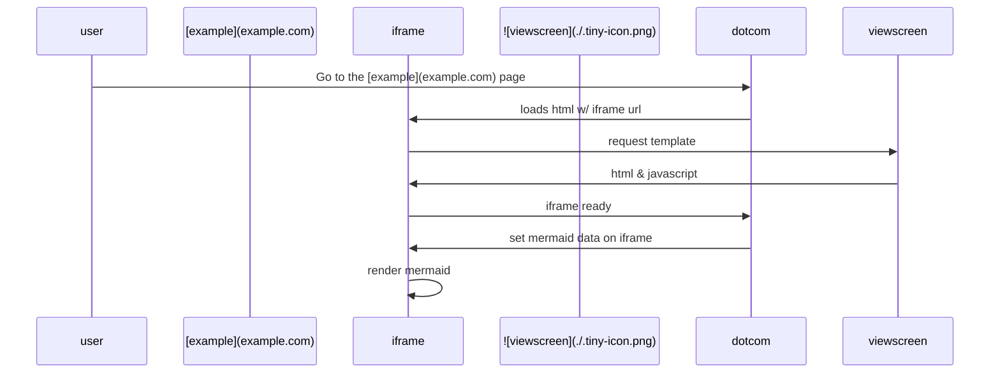
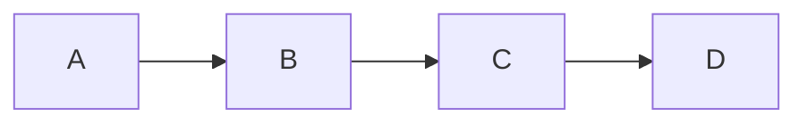
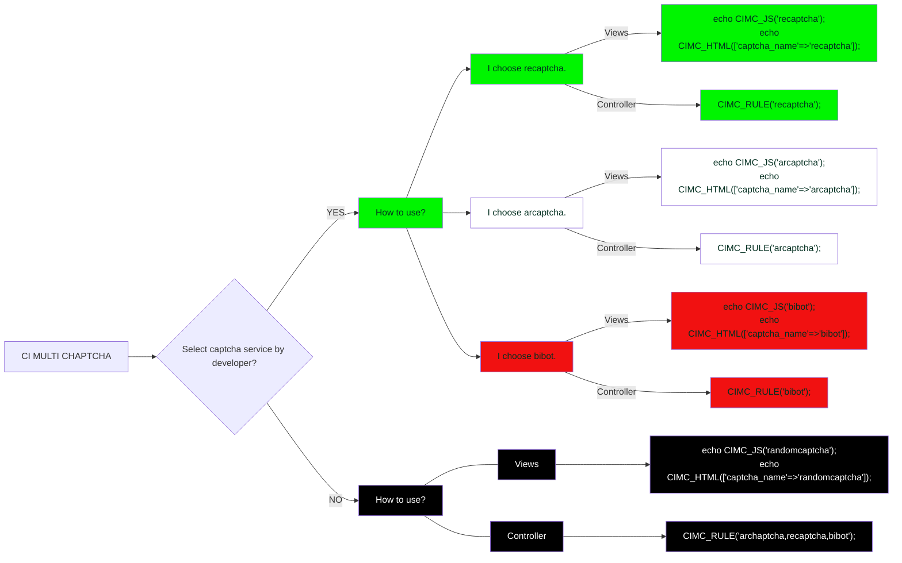
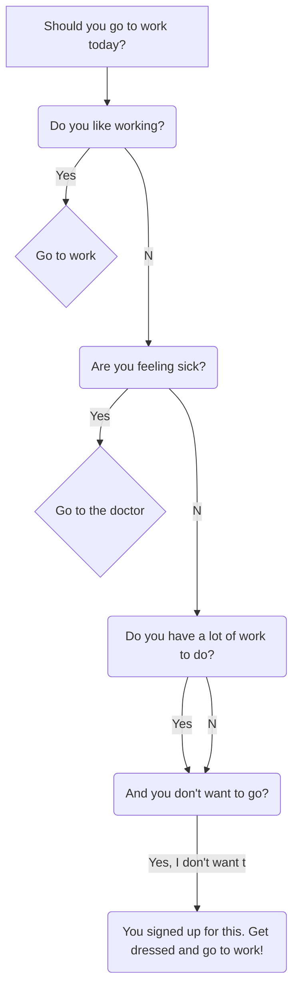

# Community list of Mermaid diagrams 
### You wish to add or change something? Please send me an [email](mailto:mvarga1989@gmail.com), create a [pull request](https://github.com/mvarga1989/Mermaid_notebook/pulls) or an [issue](https://github.com/mvarga1989/Mermaid_notebook/issues).

## Sources
-[Mermaid cheat sheet](https://jojozhuang.github.io/tutorial/mermaid-cheat-sheet/)
-[Mermaid demo](https://mvarga1989.github.io/Mermaid_notebook/)

## Examples
### Click functionality

### Flowchart:

### Sequence diagram:

	

### Gantt chart:

### Source: [martinwoodward](https://gist.github.com/martinwoodward/8ad6296118c975510766d80310db71fd?permalink_comment_id=4065246)

### Source: [LozanoMatheus](https://gist.github.com/martinwoodward/8ad6296118c975510766d80310db71fd?permalink_comment_id=4065246#gistcomment-4065246)

	

### Source: [Datamweb](https://gist.github.com/martinwoodward/8ad6296118c975510766d80310db71fd?permalink_comment_id=4067229#gistcomment-4067229)

### Source: [mathdatasimplified.com](https://mathdatasimplified.com/2022/04/29/mermaid-create-flow-chart-using-code/)
