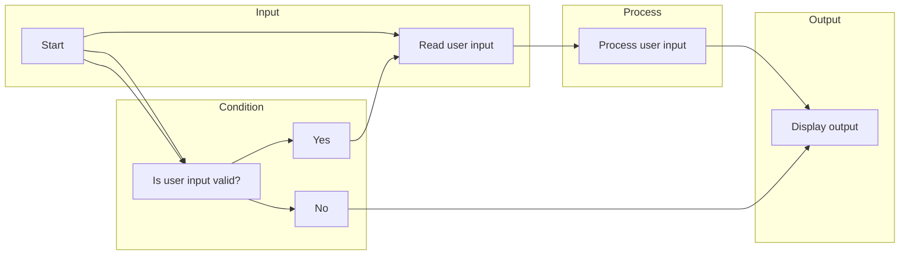
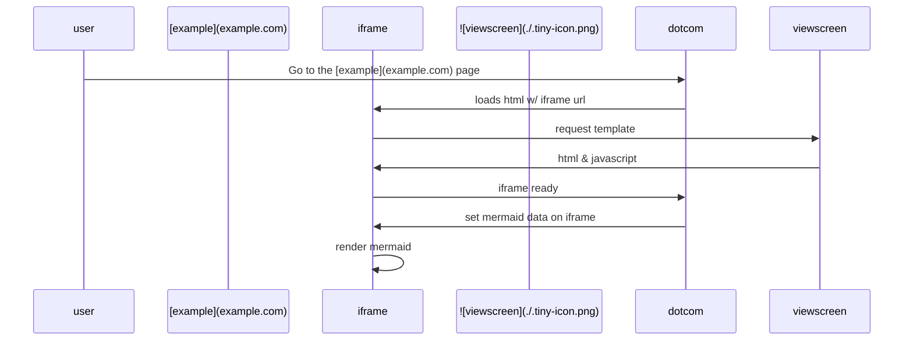
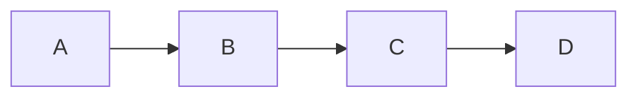
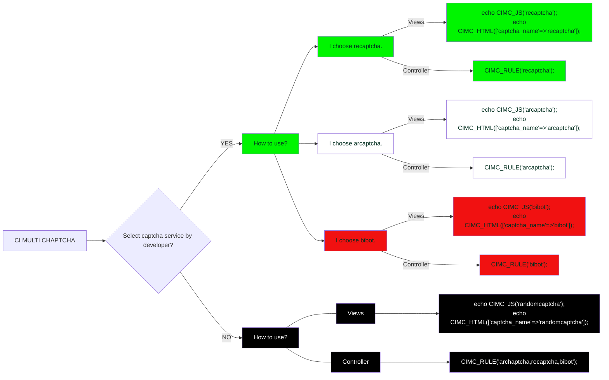
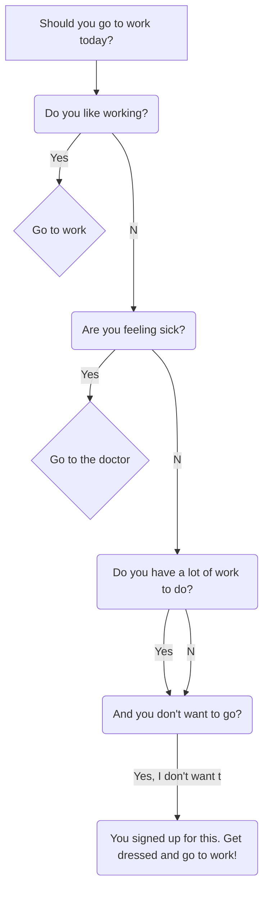

# Mermaid notebook

```mermaid
graph LR
    subgraph Input
        A[Start] --> B[Read user input]
    end
    subgraph Process
        B --> C[Process user input]
    end
    subgraph Output
        C --> D[Display output]
    end
    subgraph Condition
        A --> E[Is user input valid?]
        E --> F[Yes] --> B
        E --> G[No] --> D
    end
    A --> E
```

```mermaid
  graph TD;
      A-->B;
      A-->C;
      B-->D;
      C-->D;
```

```mermaid
sequenceDiagram
    participant user
    participant [example](example.com)
    participant iframe
    participant ![viewscreen](./.tiny-icon.png)
    user->>dotcom: Go to the [example](example.com) page
    dotcom->>iframe: loads html w/ iframe url
    iframe->>viewscreen: request template
    viewscreen->>iframe: html & javascript
    iframe->>dotcom: iframe ready
    dotcom->>iframe: set mermaid data on iframe
    iframe->>iframe: render mermaid
```

```mermaid
flowchart LR;
    A-->B;
    B-->C;
    C-->D;
    click A callback "Tooltip for a callback"
    click B "http://www.github.com" "This is a tooltip for a link"
    click A call callback() "Tooltip for a callback"
    click B href "http://www.github.com" "This is a tooltip for a link"
```
	
	

```mermaid
  flowchart LR;
      A[CI MULTI CHAPTCHA]-->B{Select captcha service by developer?};
      classDef green color:#022e1f,fill:#00f500;
      classDef red color:#022e1f,fill:#f11111;
      classDef white color:#022e1f,fill:#fff;
      classDef black color:#fff,fill:#000;
      B--YES-->C[How to use?]:::green;
      
      C-->U[I choose recaptcha.]:::green;
      U--Views-->Q["echo CIMC_JS('recaptcha');\n echo CIMC_HTML(['captcha_name'=>'recaptcha']);"]:::green;
      U--Controller-->W["CIMC_RULE('recaptcha');"]:::green;
      
      C-->I[I choose arcaptcha.]:::white;
      I--Views-->O["echo CIMC_JS('arcaptcha');\n echo CIMC_HTML(['captcha_name'=>'arcaptcha']);"]:::white;
      I--Controller-->P["CIMC_RULE('arcaptcha');"]:::white;
      
      C-->X[I choose bibot.]:::red;
      X--Views-->V["echo CIMC_JS('bibot');\n echo CIMC_HTML(['captcha_name'=>'bibot']);"]:::red;
      X--Controller-->N["CIMC_RULE('bibot');"]:::red;
      
      B--NO-->D[How to use?]:::black;
      D---Views:::black-->F["echo CIMC_JS('randomcaptcha');\n echo CIMC_HTML(['captcha_name'=>'randomcaptcha']);"]:::black; 
      D---Controller:::black-->T["CIMC_RULE('archaptcha,recaptcha,bibot');"]:::black;
```

## [Source: mathdatasimplified.com](https://mathdatasimplified.com/2022/04/29/mermaid-create-flow-chart-using-code/)

```mermaid
graph TD
    A[Should you go to work today?] --> B(Do you like working?)
    B --Yes--> C{Go to work}
    B --No--> D(Are you feeling sick?)
    D --Yes--> E{Go to the doctor}
    D --No--> F(Do you have a lot of work to do?)
    F --Yes--> H(And you don't want to go?)
    F --No--> H  
    H --Yes, I don't want to-->I(You signed up for this. Get dressed and go to work!) 
```